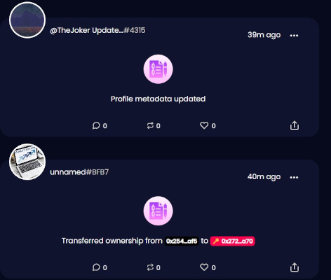

## What is [LOOKSO](https://lookso.io) 

LOOKSO is a Twitter like social media feed where users post messages and interact using Universal Profiles. It combines user-generated content with a digest of relevant events emmited by Universal Profile contracts in the blockchain. This feed is a valuable addition to block explorers and allows the users to not only follow their favorite NFT collections, artists or investors, but also to comment on their events.


## Architecure

LOOKSO leverages decentralized storage to minimize gas costs and allow media content like images and videos to be attached to messages. Every message, like and follow is saved in the Arweave blockchain and a single record file is kept updated for each Universal Profile (UP). This social media record file is nothing more than a JSON object and is saved on the Universal Profile's (UP) storage.

The [record](#Social Media Record File) is the only thing saved on the user's UP and contains a list of created posts, liked posts and followed UPs, which all together composes a user's social media state. 


There is a third actor whose role is to provide a reliable timestamp for the messages in the network. It is a [validator](#Validator) smart contract on the LUKSO blockchain and can be called to append a timestamp to the message hash and save it in its own [ERC725Y](https://github.com/ethereum/EIPs/blob/master/EIPS/eip-725.md#erc725y) storage for future validation.

All the data is indexed in a local database and served as an [API](https://api.lookso.io/documentation/static/index.html) to speed up and simplify the queries necessary to provide a consistent and fast user experience. 


## The Timestamp Registry Contract

```solidity
// SPDX-License-Identifier: MIT

pragma solidity ^0.8.7;

import { Context } from "@openzeppelin/contracts/utils/Context.sol";
import { ERC725YCore } from "@erc725/smart-contracts/contracts/ERC725YCore.sol";
import { OwnableUnset } from "@erc725/smart-contracts/contracts/custom/OwnableUnset.sol";
import { GasLib } from "@erc725/smart-contracts/contracts/utils/GasLib.sol";

contract Validator is ERC725YCore(), Context {

    constructor() {
        OwnableUnset._setOwner(address(0)); // No owner needed
    }

    function validate(bytes32 contentHash) external {
        require( getData(contentHash).length == 0, 
            "Corresponding value for this hash is not null. Content has been added under this hash before.");
        // Write to the Key-Value Storage.
        setData(contentHash, bytes(abi.encodePacked(address(_msgSender()), bytes12(uint96(block.timestamp)))));
    }

    function setData(bytes32 dataKey, bytes memory dataValue) public virtual override {
        _setData(dataKey, dataValue);
    }

    function setData(bytes32[] memory dataKeys, bytes[] memory dataValues)
        public
        virtual
        override
    {
        require(dataKeys.length == dataValues.length, "Keys length not equal to values length");
        for (uint256 i = 0; i < dataKeys.length; i = GasLib.uncheckedIncrement(i)) {
            _setData(dataKeys[i], dataValues[i]);
        }
    }

    function getTimestamp(bytes32 key) public view returns(bytes12) {
        return bytes12(bytes32(this.getData(key)) << 160);
    }

    function getAddress(bytes32 key) public view returns (bytes20) {
        return bytes20(this.getData(key));
    }
}
```

This is a generic contract that provides a timestamping service for any kind of message. Because this contract cannot sign a message attesting the timestamp provided, instead it saves the message hash in its own storage, alongside the timestamp and the original sender. Anyone can use this registry to store their claims and attest their creation date. For more information, check [LIP-Claim_Registry](https://github.com/dropps-nft/Lookso/blob/main/LIPs/lip-claim_registry.md).

For the LOOKSO project, we extended the timestamping service with the capability to write to the LSPXXSocialRegistry key on the Universal Profile. This was done for the convenience of bundling two tasks in a single transaction and avoiding extra costs for the user. The message hash is sent for validation alongside a social record that includes this message already. The message hash is timestamped and the social record URL written on the Universal Profile. 

## Event scraping and translation

One of the key features of the LOOKSO platform is that it scrapes blockchain events related to Universal Profiles and displays them in a user friendly way in its feed. This is a game-changer when it comes to visualizing what's happening on the network and interacting with it. 



You can comment, repost and like an event-based post like any other user-generated content. This feed will be hotter than ever 🔥!

Events and their index parameters are saved on the database, alongside their translation and the Universal Profile that emitted them. 


## Social Media Record File

This record is saved under the (provisory) Key name of "LSPXXSocialRegistry". Here is the schema according to [LSP2](https://github.com/lukso-network/LIPs/blob/main/LSPs/LSP-2-ERC725YJSONSchema.md):

```JSON
{
    "name": "LSPXXSocialRegistry",
    "key": "0x661d289e41fcd282d8f4b9c0af12c8506d995e5e9e685415517ab5bc8b908247",
    "keyType":"Singleton",
    "valueType": "bytes",
    "valueContent": "JSONURL",

}
```

And here is an example of the record file after decoding and fetching the JSONURL:

```JSON
{
  "LSPXXSocialRegister": {
    "profile_posts": [
      {
        "url": "ipfs://bafkreicwro4hgt42c256ggdnsd5ovrw6g62barfhsfd2umxdye764hlar4",
        "hash": "0x64810d3e12ade0816a03fb96d8a763f2cb4f6f00afbe5b5f5e81179892e7f00f"
      }
    ],
    "following": [
      "0xA5284665954a54d12737Da405824160cCE05B0B0",
      "0xB1a2B3518c30Eb82bb18Fe75456e83B692A75FFa"
    ],
    "likes": [
      "0xb65a4ddc17641434ef1a3db047b7d52a08e4c22a994ab6ffe580d7a786ca9d78",
      "0x0017eb3f3b2c10c3387c710e849c64527ae331bfb2d42fb70fbe95588ff5d6cd",
      "0x64810d3e12ade0816a03fb96d8a763f2cb4f6f00afbe5b5f5e81179892e7f00f",
    ]
  }
}
```

## The Post Object

```JSON
{
  "LSPXXProfilePost": {
    "version":"0.0.1",
    "message": "This is the first Lookso post.",
    "author": "0x742242E9572cEa7d3094352472d8463B0a488b80",
    "validator": "0x049bAfA4bF69bCf6FcB7246409bc92a43f0a7264",
    "nonce": "415665014",
    "links": [
      {
        "title": "Our website",
        "url": "https://dropps.io"
      }
    ],
    "asset": {
      "hashFunction": "keccak256(bytes)",
      "hash": "0x813a0027c9201ccdec5324aa32ddf0e8b9400479662b6f243500a42f2f85d2eb",
      "url": "ar://gkmVUoHE4Ay6ScIlgV4E7Fs1m13LfpAXSuwuRGRQbeA",
      "fileType": "jpg"
    },
    "parentHash":"0xdc1812e317c6cf84760d59bda99517de5b5c5190fcf820713075430337805340"
  },
  "LSPXXProfilePostHash": "0x0017eb3f3b2c10c3387c710e849c64527ae331bfb2d42fb70fbe95588ff5d6cd",
  "LSPXXProfilePostSignature": "0x2845551019619d59657b6e485d1cb2067479a5bc364270030d7c4143b4cc0ee5279432bee8425f17d091f067e6b8f987390900b1fd82bef52fcb4c8b2b06ab901b"
}
```

This is an example of a post object. 


## Validator


## Future improvements

* Allow developers to add their own event translations so they can be displayed in a cool way
* Refactor follows so that universalReceiver can be called and a UP can decide what to do in that situation
* Add a relay service
* Improve event translation (for ex. Profile metadata updated can display the before and after values)
* Narrow the permissions given to the validator contract for a specific key (LSPXXSocialRegistry).

### Blockchain
Provides the censorship resistant fabric where users can store their connections and content can be referenced. The rules by which the social network shapes itself are written and enforced in the protocol, no one is able to cancel or 

* Decentralized storage networks - provides censorship resistance while cutting down on the cost of storing data to the blockchain.
* 

### Decentralized Storage


### Local database

