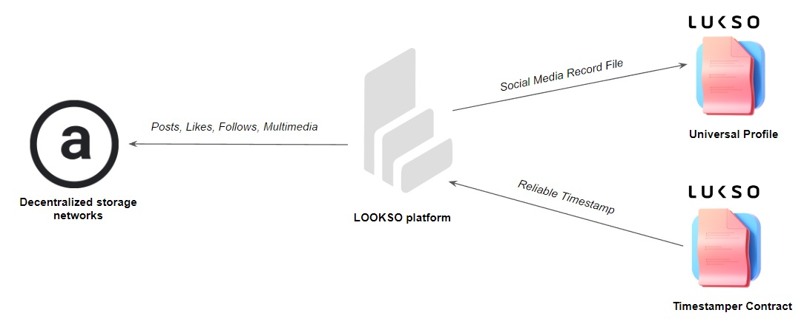

## What is [LOOKSO](https://lookso.io) 

LOOKSO is a Twitter like social media feed where users post messages and interact using Universal Profiles. It combines user-generated content with a digest of relevant events emmited by Universal Profile contracts in the blockchain. This feed is a valuable addition to block explorers and allows the users to not only follow their favorite NFT collections, artists or investors, but also to comment on their events.


## Architecure

LOOKSO leverages decentralized storage to minimize gas costs and allow media content like images and videos to be attached to messages. Every message, like and follow is saved in the Arweave blockchain and a single registry is kept updated for each address. This registry is nothing more than a JSON object.

On the Universal Profile of the user, only the registry is stored. This [registry](#Registry) contains a list of created posts, liked posts and followed UPs, which all together composes a user's social media state. 



There is a third actor whose role is to provide a reliable timestamp for the messages stored. It is a [validator](#Validator) smart contract on the LUKSO blockchain that can be called to append a timestamp to the message hash and save it in storage for future validation.


## Registry

The registry is saved under the (provisory) Key name of "LSPXXSocialRegistry". Here is the schema according to LSP2:

```JSON
{
    "name": "LSPXXSocialRegistry",
    "key": "0x661d289e41fcd282d8f4b9c0af12c8506d995e5e9e685415517ab5bc8b908247",
    "keyType":"Singleton",
    "valueType": "bytes",
    "valueContent": "JSONURL",

}
```

And here is an example of the registry file after decoding and fetching the JSONURL:

```JSON
{
  "LSPXXSocialRegister": {
    "profile_posts": [
      {
        "url": "ipfs://bafkreicwro4hgt42c256ggdnsd5ovrw6g62barfhsfd2umxdye764hlar4",
        "hash": "0x64810d3e12ade0816a03fb96d8a763f2cb4f6f00afbe5b5f5e81179892e7f00f"
      }
    ],
    "following": [
      "0xA5284665954a54d12737Da405824160cCE05B0B0",
      "0xB1a2B3518c30Eb82bb18Fe75456e83B692A75FFa"
    ],
    "likes": [
      "0xb65a4ddc17641434ef1a3db047b7d52a08e4c22a994ab6ffe580d7a786ca9d78",
      "0x0017eb3f3b2c10c3387c710e849c64527ae331bfb2d42fb70fbe95588ff5d6cd",
      "0x64810d3e12ade0816a03fb96d8a763f2cb4f6f00afbe5b5f5e81179892e7f00f",
    ]
  }
}
```

## The Post Object

```JSON
{
  "LSPXXProfilePost": {
    "version":"0.0.1",
    "validator": "0x049bAfA4bF69bCf6FcB7246409bc92a43f0a7264",
    "message": "This is the first Lookso post.",
    "author": "0x742242E9572cEa7d3094352472d8463B0a488b80",
    "nonce":
    "links": [
      {
        "title": "Our website",
        "url": "https://dropps.io"
      }
    ],
    "asset": {
      "hashFunction": "keccak256(bytes)",
      "hash": "0x813a0027c9201ccdec5324aa32ddf0e8b9400479662b6f243500a42f2f85d2eb",
      "url": "ar://gkmVUoHE4Ay6ScIlgV4E7Fs1m13LfpAXSuwuRGRQbeA",
      "fileType": "jpg"
    }
  },
  "LSPXXProfilePostHash": "0x0017eb3f3b2c10c3387c710e849c64527ae331bfb2d42fb70fbe95588ff5d6cd",
  "LSPXXProfilePostSignature": "0x2845551019619d59657b6e485d1cb2067479a5bc364270030d7c4143b4cc0ee5279432bee8425f17d091f067e6b8f987390900b1fd82bef52fcb4c8b2b06ab901b"
}
```

This is an example of a post object. 


## Validator


### Blockchain
Provides the censorship resistant fabric where users can store their connections and content can be referenced. The rules by which the social network shapes itself are written and enforced in the protocol, no one is able to cancel or 

* Decentralized storage networks - provides censorship resistance while cutting down on the cost of storing data to the blockchain.
* 

### Decentralized Storage


### Local database

